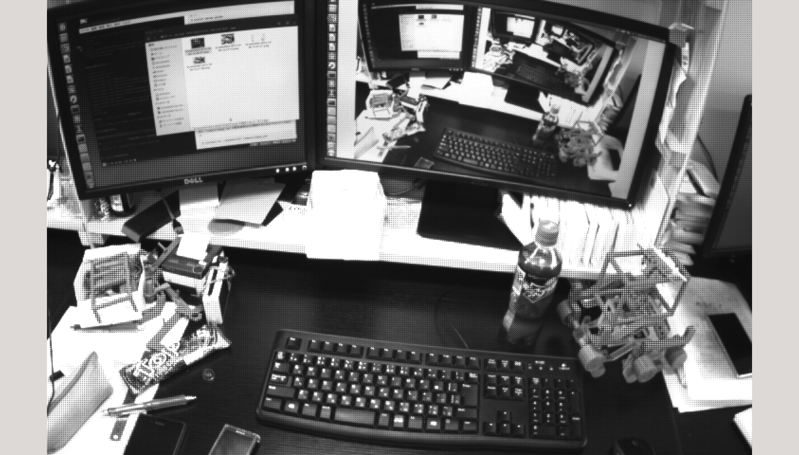

# DFM22BUC03-MLカメラ
#  TBL3.6C-2MPレンズ


##Linuxで始める
参考
* [https://github.com/TheImagingSource/tiscamera/wiki/Getting-Started-with-USB-2.0-cameras-on-a-Raspberry-PI-or-on-other-Linux-Systems](https://github.com/TheImagingSource/tiscamera/wiki/Getting-Started-with-USB-2.0-cameras-on-a-Raspberry-PI-or-on-other-Linux-Systems)

まず、[wiki](https://github.com/TheImagingSource/tiscamera/wiki/Getting-Started-with-USB-2.0-CMOS-Cameras)に従いファームウェアをアップデートする。

==guvcview==のインストールができたらグレースケール画像が得られる。これは、カメラがbayer rawデータを出力するためである。
次に、Gstreamerパイプラインをビルドする。以下のコマンドによりThe Imaging Source リポジトリよりクローンする。
```bash
$ git clone https://github.com/theimagingsource/tiscamera
```
"tiscamera"ディレクトリができていることだろう。また、いくつかのパッケージをインストールする必要がある。
```bash
$ sudo apt-get install autoconf libglib2.0 libudev-dev libgstreamer0.10 gstreamer0.10-plugins-base gstreamer0.10-plugins-good gstreamer0.10-plugins-bad gstreamer0.10-tools gstreamer-plugins-base0.10-dev
```
ディレクトリを==tiscamera/src==に移し、以下のコマンドを打つ。
```bash
$ ./bootstrap.sh
$ ./configure
.
..
...
config.status: creating Makefile
config.status: creating config.h
config.status: config.h is unchanged

Configuration:
  Building with aravis as a dependency:  no

```
エラーが出なかったら
```bash
$ make
```
する。いくつかの情報が[Readme](https://github.com/TheImagingSource/tiscamera/tree/master/src)に記してある。
==Gstreamer==が新しくビルドされたパイプラインモジュールを見つけるようにするために以下のコマンドを打つ。
```bash
$ make install
```
これで、[https://github.com/TheImagingSource/tiscamera/wiki/First-Steps](https://github.com/TheImagingSource/tiscamera/wiki/First-Steps)の下の方にあるいくつかのパイプラインを試すことができる。例えば、
DFK 72AUC02(640x480,15fps)の場合、以下となる。
```bash
$ gst-launch-0.10 v4l2src ! video/x-raw-gray,width=640,height=480,framerate=15/1 ! tisvideobufferfilter ! tis_auto_exposure ! tiscolorize ! queue ! tiswhitebalance ! queue ! bayer2rgb ! queue ! ffmpegcolorspace ! ximagesink
```
映像はカラーとなり、露光時間は現在の状況によって自動でセットされる。

もし、ラズベリーパイや他のカラーカメラより早いコンピュータを持っているのなら、以下のコマンドを試すことができる。
```bash
$ gst-launch-0.10 v4l2src ! video/x-raw-gray ! tisvideobufferfilter ! tis_auto_exposure ! tiscolorize ! queue ! tiswhitebalance ! queue ! bayer2rgb ! queue ! ffmpegcolorspace ! ximagesink
```
もし、モデル名が"DMK"や"DMM"で始まるモノクロカメラを持っているのならば、以下のコマンドを試せるかもしれない。
```bash
$ gst-launch-0.10 v4l2src ! video/x-raw-gray ! tisvideobufferfilter ! tis_auto_exposure ! ffmpegcolorspace ! ximagesink
```
ウェブカメラ付きのノートパソコンなど、コンピュータに2つ以上のカメラが接続されている場合、カメラを識別する必要がある。
```bash
$ ls /dev/vid*
/dev/video0  /dev/video1
```
もし、`/dev/video1`がThe Imaging Source カメラなら以下のコマンドとなる。
```bash
$ gst-launch-0.10 v4l2src device=/dev/video1 ! video/x-raw-gray ! tisvideobufferfilter ! tis_auto_exposure ! tiscolorize ! queue ! tiswhitebalance ! queue ! bayer2rgb ! queue ! ffmpegcolorspace ! ximagesink
```


## gscamのインストール
参考サイト:

* [http://wiki.ros.org/gscam#Running](http://wiki.ros.org/gscam#Running)
* [https://github.com/ros-drivers/gscam](https://github.com/ros-drivers/gscam)

ROSでカメラの映像を見るには
* usb_cam
* umd_cam
* uvc_cam

などのドライバーがあるが、このカメラはY800（GREY）というフォーマットを使用しており、これらのドラバーは対応していない。
よって、唯一映像を見ることができたgscamを使うこととした。


```bash
$ git clone https://github.com/ros-drivers/gscam
$ rosmake
$ roscd gscam
$ cd bin
$ export GSCAM_CONFIG="v4l2src device=/dev/video0 ! videoscale ! video/x-raw-gray,width=744,height=480 ! ffmpegcolorspace !"
$ rosrun gscam gscam
```

実際に映像を見てみる...
```bash
$ rosopic list
/camera/camera_info
/camera/image_raw
/camera/image_raw/compressed
/camera/image_raw/compressed/parameter_descriptions
/camera/image_raw/compressed/parameter_updates
/camera/image_raw/compressedDepth
/camera/image_raw/compressedDepth/parameter_descriptions
/camera/image_raw/compressedDepth/parameter_updates
/camera/image_raw/theora
/camera/image_raw/theora/parameter_descriptions
/camera/image_raw/theora/parameter_updates
/rosout
/rosout_agg
```
この中の`/camera/image_raw`が映像なので
```bash
$ rosrun image_view image_view image:=/camera/image_raw
```
とすると映像が見れる。



また、`/camera/image_raw`の配信速度(fps)を確認するには以下のコマンドを打つ
```bash
$ rostopic hz --window=1000 /camera/image_raw
```

Gsteamerの設定方法は[ここ](http://wiki.oz9aec.net/index.php?title=Gstreamer_cheat_sheet&oldid=1829)を参照。

## camera_calibration


